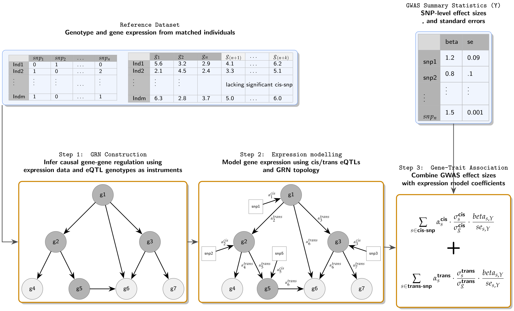

# GenEpicure: Gene Regulatory Network-Driven Transcriptome-Wide Association Studies (GRN-TWAS)

This repository implements the GNR-TWAS method that combines **tissue-specific gene regulatory networks (GRNs)** with **transcriptome-wide association studies (TWAS)** for studying gene-complex disease associations. You can find details of this framework in the pre-print article [*A Network-Driven Framework for Enhancing Gene-Disease Association Studies in Coronary Artery Disease* – Mohammad, Björkegren and Michoel, 2025](https://arxiv.org/pdf/2501.19030)[^GNR-TWAS].

## Key Features

|                                                                                                                                                                                               |
| :--------------------------------------------------------------------------------------------------------------------------------------------------------------------------------------------------------------------------------------------: |
| *Pipeline overview of the GRN-TWAS method as described in [*A Network-Driven Framework for Enhancing Gene-Disease Association Studies in Coronary Artery Disease* – Mohammad, Björkegren and Michoel, 2025](https://arxiv.org/pdf/2501.19030)* |

1. **Infere causal gene-gene regulation using expression data and eQTL genotypes.** For GRN reconstruction from genotype and transcriptome data, GenEpicure uses [BioFindr](https://lab.michoel.info/BioFindr.jl/stable/), the Julia implementation of the [**Findr**](https://github.com/lingfeiwang/findr)[^FINDR] method.
2. **Gene expression modelling using both *cis* and *trans* eQTLs** and GNR topology as infered in step one by Findr. 2 "regular" Ridge regression models are trained, one for **cis** and one for **trans** eQTLS, and they are then combined additively.
3. **Evaluates gene-disease associations** by combining **GWAS summary statistics** with expression model coefficients as detailed in [*A Network-Driven Framework for Enhancing Gene-Disease Association Studies in Coronary Artery Disease* – Mohammad, Björkegren and Michoel, 2025](https://arxiv.org/pdf/2501.19030)[^GNR-TWAS]. The gene-disease association is evaluated based on the [S-PrediXcan](https://www.nature.com/articles/s41467-018-03621-1)[^PrediXcan] method and combines cis and trans models and based on .

## Installation

<!-- TODO -->
Coming soon.

## Usage

<!-- TODO -->

Coming soon.


## Data Sources

GenEpicure requires the following types of data:

- Gene expression matrix
- Genotype matrix
- eQTL mapping table
- Genome-wide summary statistics

And follow the same notation conventions as in [BioFindr](https://lab.michoel.info/BioFindr.jl/stable/).

### Genotype and gene expression

Individual-level genotype data and RNA sequencing-based gene expression profiles for the same individuals.

#### Gene expression matrix `dX`

Contains float, corresponding to normalized gene expression levels.

1. N rows, one per sample, (optionally with an identifier as first column)
2. G columns, one per gene, with an identifier (string) as header

```plaintext
sample_id   geneA     geneB      geneC      geneD       …
1          -0.241     0.832      -1.104     0.157       …
2           0.473    -0.116       0.291    -0.842       …
3          -1.022     0.507       0.063     0.334       …
…              …         …           …         …        …
```

#### Genotype matrix `dG`

Contains integer 0/1/2, corresponding to SNP genotypes coded as 0, 1, or 2 based on the number of alternative alleles.

1. N rows, one per sample. Must be the same order as the gene expression matrix or having matching identifiers as first column.
2. S columns, one per SNP. with a SNP identifer (string) as header

```plaintext
sample_id   rs1001   rs1002   rs1003   rs1004    …
1              0        1        2        0      …
2              1        1        0        2      …
3              2        0        1        1      …
…              …        …        …        …      …
```

#### eQTL mapping table `dE`

Contains string, corresponding to SNP-gene identifiers pairs.

1. S rows, one per number of SNP-gene pairs
2. 2 (or more) columns:
    1. SNP identifier (string) matching names the genotype matrix `dG`.
    2. Gene identifier (string) matching names in the gene expression matrix `dX`.
    3. (optional) Additional columns with eQTL statistics (beta, t-stat, p-value, adj.p-value, etc.)

```plaintext
Row   snp_id    gene_id      beta       t-stat    p-value     adj.p-value
1     rs1001    geneA      -0.378048   -3.95352   8.79e-05      0.03698
2     rs1002    geneA       0.569251    6.42444   3.03e-10      0.00050
3     rs1003    geneB       0.321534    4.21718   2.93e-05      0.01699
4     rs1004    geneD       0.329905    4.08898   5.03e-05      0.04098
…       …         …            …           …          …            …
```

### Genome-wide summary statistics

GWAS meta-analysis results.

- **snp_id**: Identifier for genetic variant.
- **beta**: Log odds ratio representing effect sizes. If other statistics are used (e.g., beta values), adjust the association code accordingly.
- **se_beta**: The standard error of the estimated effect size.

```plaintext
snp_id     beta      se_beta
rs1001     0.050       0.27
rs1002     0.005       0.01
rs1003     0.003       0.01
rs1004     0.001       0.01
rs1006     0.003       0.01
  …          …          …
```

[^GNR-TWAS]: Mohammad GI, Björkegren JL, Michoel T. A Network-Driven Framework for Enhancing Gene-Disease Association Studies in Coronary Artery Disease. ArXiv [Preprint]. 2025 Jan 31:arXiv:2501.19030v1. PMID: 39975434; PMCID: PMC11838773.
[^FINDR]: Wang L, Michoel T (2017) Efficient and accurate causal inference with hidden confounders from genome-transcriptome variation data. PLoS Comput Biol 13(8): e1005703. https://doi.org/10.1371/journal.pcbi.1005703
[^PrediXcan]: Barbeira, A.N., Dickinson, S.P., Bonazzola, R. et al. Exploring the phenotypic consequences of tissue specific gene expression variation inferred from GWAS summary statistics. Nat Commun 9, 1825 (2018). https://doi.org/10.1038/s41467-018-03621-1